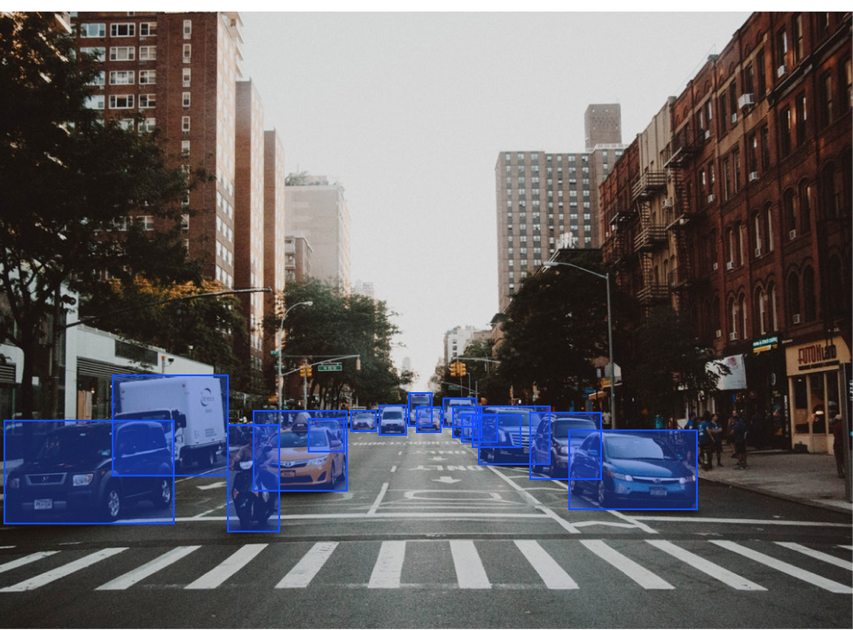
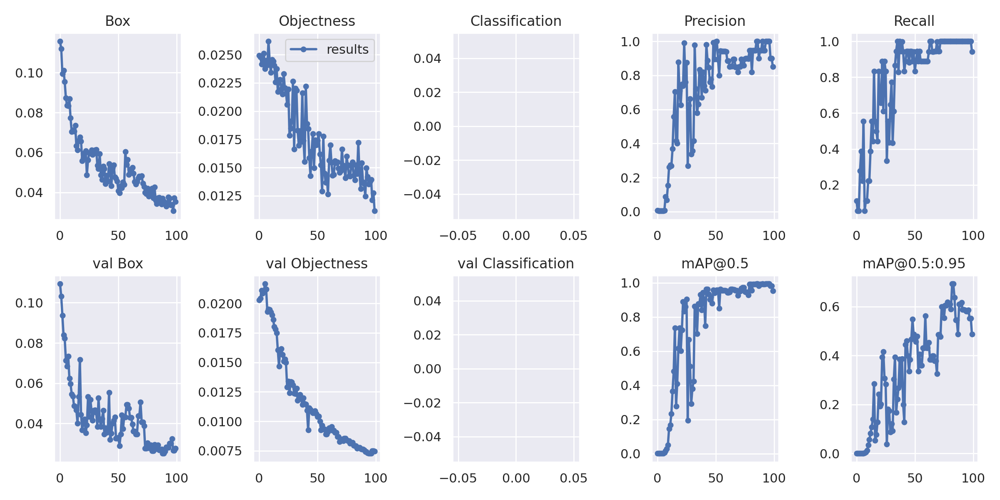
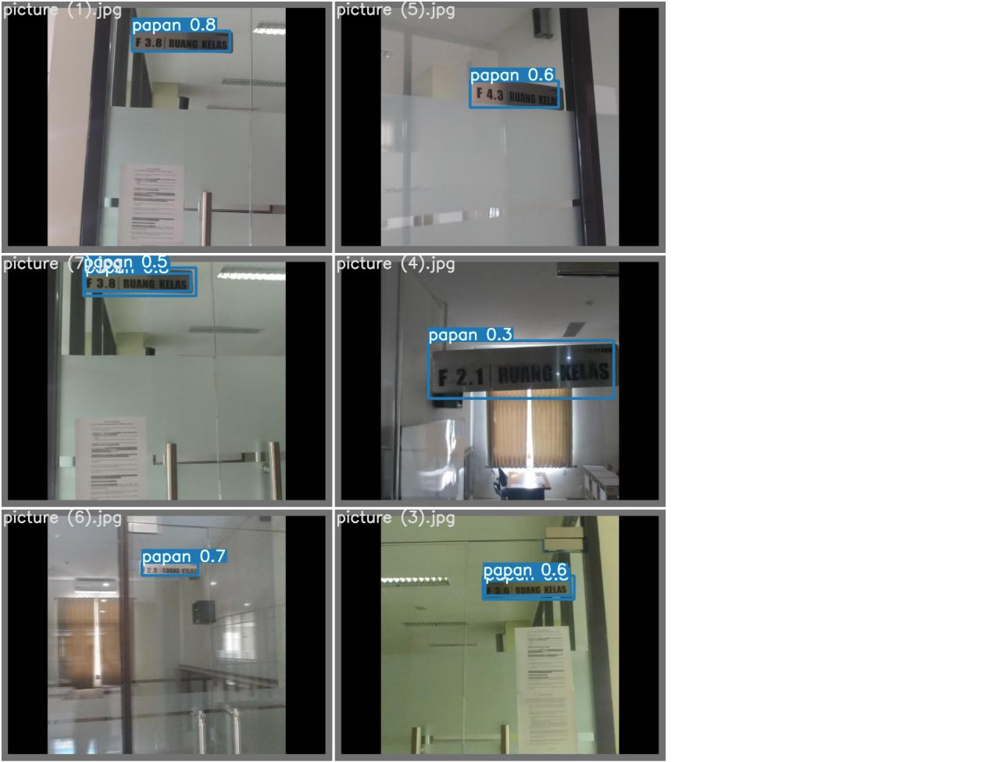
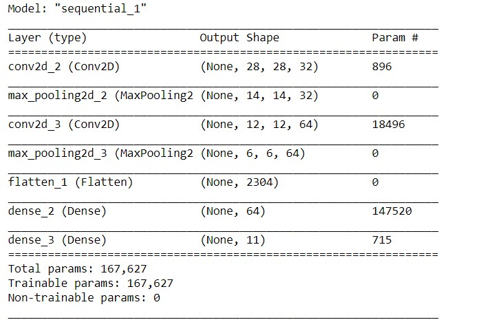
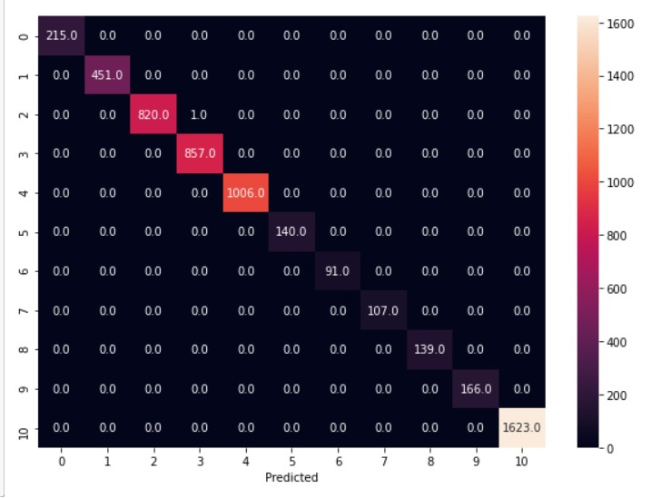
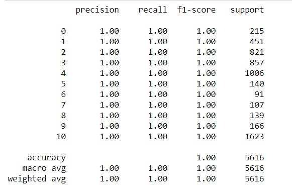
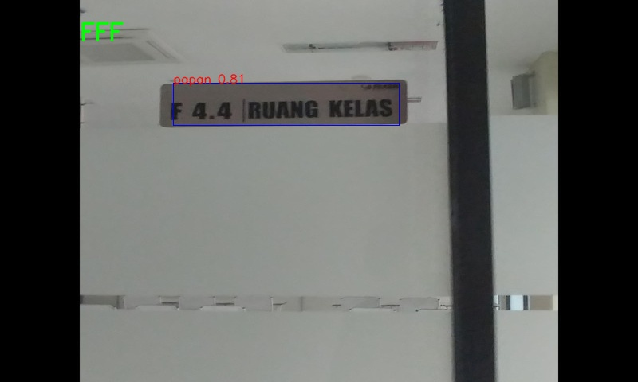

# Plate Recognition Using YOLO and CNN

- [Plate Recognition Using YOLO and CNN](#plate-recognition-using-yolo-and-cnn)
  - [Intorduction](#intorduction)
  - [Process Create This Project](#process-create-this-project)
  - [How to run this program](#how-to-run-this-program)
  - [Preview This Project](#preview-this-project)
  - [Conclustion my own CNN model vs easyocr](#conclustion-my-own-cnn-model-vs-easyocr)


## Intorduction
  These project is to detect the plate with label name of ***"papan"*** , these project only detect 1 class called "papan" . after that take the bounding box and get the text inside the bounding box. to get the text inside bounding box these project use 2 method first using my own trained **CNN model** and used the python package name **easyocr** . in the conclustion i compare the accuracy of CNN and easyocr.

## Process Create This Project

1. **Create bounding box for your dataset**
   A bounding box is an imaginary rectangle that serves as a point of reference for object detection and creates a collision box for that object. these are the example of boundig box

   

   You can label your dataset image using [Labelimg](https://github.com/tzutalin/labelImg) or [makesense.ai](https://www.makesense.ai/) and choose the YOLO format or the file with extenstion *.txt

2. **Create YOLO model for object detection**
   in these project i use YOLOv5 to make object deteaction model. You can learn more about the yolo in the documentation [link here](https://github.com/ultralytics/yolov5)

   > YOLO an acronym for 'You only look once', is an object detection algorithm that divides images into a grid system. Each cell in the grid is responsible for detecting objects within itself.

   if you want to create your own object detection with custom dataset you can watch these helpful tutorial to achieve that in [here](https://www.youtube.com/watch?v=GRtgLlwxpc4)

   **The result of training process**
   
   **Preview test dataset**
   

3. **Create CNN model for classification**
   A Convolutional Neural Network, also known as CNN or ConvNet, is a class of neural networks that specializes in processing data that has a grid-like topology, such as an image.

   in these project CNN use to read the 3 first charachter text inside the bounding box. and in these project i use data augmentation to make more dataset.

   > CNN have only 11 label that is 0-9 and F

   - The architecture of CNN
   
   - The confosuin matrix of CNN
   
   - The Classification Report of CNN
   

4. **Create Segmentation for Charachter**
   A segmentation is to takes an image as input and outputs a collection of regions (or segments) which can be represented as

   in these project i use some code from these [kaggle notebok](https://www.kaggle.com/foolishboi/license-plate-recognition-final) to create segmentation to my plate

   **The result of my Segmentation**
   

5. **Wrap all the project code**
   with all that model ready and the segmentation to get each charachter in the image ready. i wrap all into one folder to easily organize and i use some code from these [github repo](https://github.com/biplob004/motorcycle_license_plate.git)

## How to run this program
1.  You must have python 3 install in your computer if you haven't python you can download and install your python from [here](https://www.python.org/downloads/)
2.  Clone these github repo with these command
  ```git
  git clone https://github.com/ragilhadi/plate-recognition-yolo-cnn
  ```
3. Run this command to install all the python packages
```python
cd plate-recognition-yolo-cnn
pip install -r requirements.txt #for windows
pip3 install -r requirements.txt #for mac or windows
```
> Note: You must have all the python package to run the project

4. You can run the project from command prompt with theese command

- For **image** input and use **CNN** type this command
```python
python main.py #for windows
python3 main.py #for mac or linux
```

- For live **video input** and use **CNN** type this command
```python
python camera.py #for windows
python3 camera.py #for mac or linux
```

- For **image** input and use **easyocr** type this command
```python
python image_ocr.py #for windows
python3 image_ocr.py #for mac or linux
```

- For **live video** input and use **easyocr** type this command
```python
python camera_ocr.py #for windows
python3 camera_ocr.py #for mac or linux
```


## Preview This Project
- This preview of the image with **CNN** to classify the text


- This preview of the image with **easyocr** to classify the text


## Conclustion my own CNN model vs easyocr
the result of these method to recognize the text inside the plate be depicted in these picture
